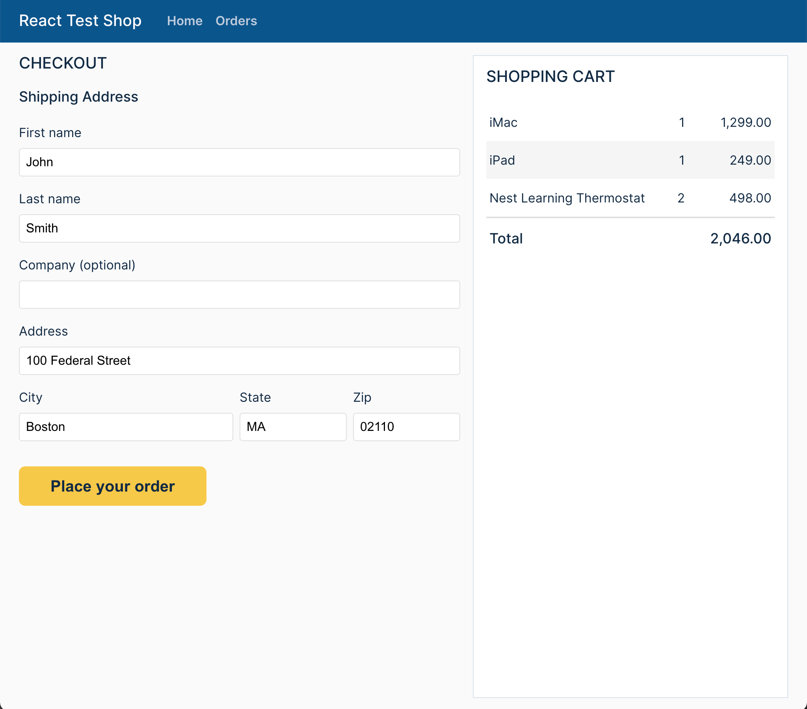
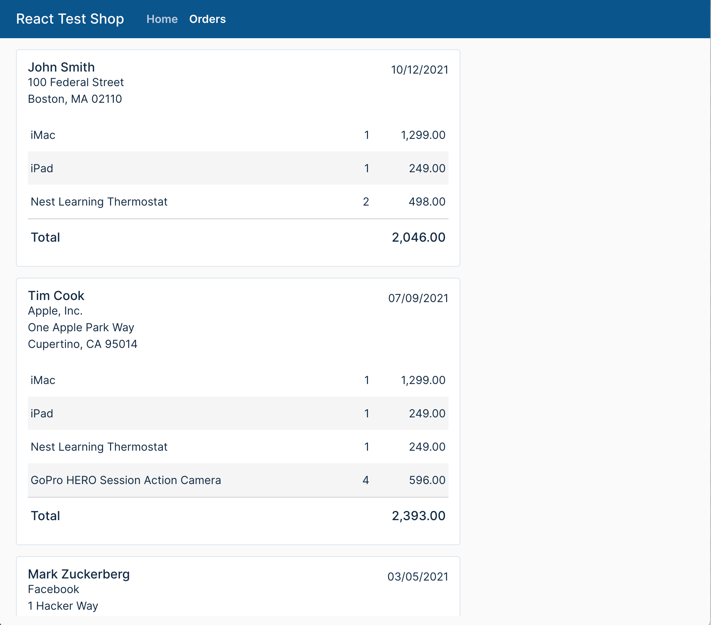

# React Testing Techniques

This project demonstrates best practices in testing React applications by
implementing a realistic online shopping application.

We use the following tools for testing:

**Unit Testing**

- [Jest](https://jestjs.io/) - a testing framework designed to ensure
  correctness of any JavaScript or TypeScript codebase

- [React Testing Library](https://testing-library.com/) - a testing framework
  for React components that encourages better testing practices

- [Mock Service Worker](https://mswjs.io/) - a framework to mock APIs by
  intercepting requests at the network level. It allows us to reuse the same
  mock definition for testing, development, and debugging.

**Integration Testing**

- [Cypress](https://www.cypress.io/) - a testing framework for fully built Web
  applications running in a browser

**Manual Testing**

- [Storybook](https://storybook.js.org/) - a tool that helps build components in
  isolation and record their states as stories. Stories make it easy to explore
  a component in all its permutations no matter how complex. They also serve as
  excellent visual test cases. Storybook testing can also be automated. For
  details, look at the
  [Storybook documentation](https://storybook.js.org/docs/react/workflows/testing-with-storybook).

_This project was bootstrapped with
[React Accelerate](https://github.com/PublicisSapient/cra-template-accelerate)._

## Guiding Principles

Before discussing guiding principles, let's talk about why we write tests in the
first place! For me, it is about building confidence in what I am delivering.
Tests provide a mechanism to verify the intent of my code by exercising it in
various ways. Moreover, they give me the confidence that I have not broken
anything when I refactor or extend the code to meet new requirements. The last
thing I want is to get a call at 3:00 AM to fix a bug that has crashed my app!

Now that we have discussed the motivation behind testing, let's jump right into
the guiding principles.

### Don't test implementation details

If your test does something that the consumer of your code doesn't, chances are
that you are testing implementation details. For example, you may be exposing a
private function just to test your component. This is a code smell, don't do
it - a refactor can easily break your tests. Steer away from testing tools that
allow you to test implementation details (e.g. Enzyme). Instead, use tools such
as React Testing Library which make it very difficult to include implementation
details in your tests. For more details, refer to
[Write tests. Not too many. Mostly integration.](https://kentcdodds.com/blog/write-tests)
by Kent C. Dodds.

### Test your components as your user would

The traditional testing wisdom was to write a lot of unit tests to test
individual "units". We used to isolate our components from their environment
using mocks. This approach still makes sense to test pure functions where the
output is strictly based on its input. However, for front-end components which
depend on communicating with their surrounding components, mocking reduces our
confidence in the integrations. The latest thinking is to test several units
together to recreate real interaction scenarios, hence the name _integration
testing_.

This brings us to the guiding principle which is the foundation of the React
Testing Library:

> The more your tests resemble the way your software is used, the more
> confidence they can give you.

This translates to writing more "integration" style tests where, for example,
you may want to drop a couple of components under a `<Context.Provider>` to test
real user interactions. Or you may use [Mock Service Worker](https://mswjs.io/)
to mock APIs at the network level rather than mocking at the component or
service layer.

### Don't focus on code coverage

Some organizations put undue focus on code coverage for applications, mandating
a high number as the threshold. Unfortunately this set the wrong goal for
developers because beyond a certain point, the returns are not worth the effort.
You start seeing developers gaming the system by writing meaningless tests.
Instead, the focus should be on use case coverage. Think of all the use cases
(including corner cases) that you want to test to feel confident about your code
quality. This approach will automatically yield high code coverage.

### Structuring code - Pure functions vs. UI components

Structure your code so that business logic is pushed into pure JavaScript
functions as opposed to UI components. A pure function is a function where the
return value is only determined by its input values, without observable side
effects. Such functionality should not be embedded in UI components because it
becomes harder to test. See [here](./src/models/Cart.ts) for an example for pure
functions and [the related tests](./src/models/Cart.test.ts).

### Snapshot testing vs. traditional unit testing

Use snapshot tests only for small focused components where the snapshots can be
easily read and verified for correctness (usually 20-30 lines max). For larger
snapshots, developers tend to be undisciplined about reviewing them before
committing, resulting in buggy code to be committed. Moreover, good tests encode
the developer's intention. Snapshot tests lack the expression of this intent. So
for anything beyond the simplest of components, prefer a traditional unit test.

Note: If you need to write a snapshot test, I recommend using
react-testing-library because it generates cleaner snapshots. The other popular
way of generating snapshots is react-test-renderer, but its output contains
component properties and other details that are not relevant. Here's an
[example of a snapshot test](./src/pages/NotFoundPage/NotFoundPage.test.tsx)
using react-testing-library.

## Techniques

- [Difference between queryBy, getBy and findBy queries](./docs/difference-between-query-types.md)
- Checking for existence of an element
- Waiting for removal of an element
- Waiting for something to happen
- fireEvent() vs userEvent
- Mocking an event handler (see ProductView test)
- Using Mock Service Worker vs. Jest mocking
- Overriding/mocking MSW handlers (see CartView & CatalogView tests)
- Testing for page navigation
- Suppressing console errors

## Getting Started

> Note: If you prefer to use npm, please feel free to replace the yarn commands
> in this section with equivalent npm commands.

Make sure your development machine is set up for building React apps. See the
recommended setup procedure
[here](https://github.com/nareshbhatia/react-learning-resources#developer-machine-setup).

Execute the following commands to install dependencies:

```sh
yarn install
```

Execute the following commands to run the app:

```sh
yarn start
```

Now point your browser to http://localhost:3000/.

## Running Unit Tests

Execute one of the following command to run unit tests.

```sh
yarn test # interactive mode

# OR

yarn test:coverage # non-interactive mode with coverage information
```

## Running End-to-End Tests

```sh
yarn start # starts a local server hosting your react app

# in a difference shell, run cypress
yarn cypress:open
```

## Running Storybook

```sh
yarn storybook
```

## Screenshots

### Home Page


### Checkout Page



### Order Page



## References

### Testing Best Practices

- [How to know what to test](https://kentcdodds.com/blog/how-to-know-what-to-test)
- [Write tests. Not too many. Mostly integration.](https://kentcdodds.com/blog/write-tests)
- [Write fewer, longer tests](https://kentcdodds.com/blog/write-fewer-longer-tests)
- [Making your UI tests resilient to change](https://kentcdodds.com/blog/making-your-ui-tests-resilient-to-change)
- [Testing Implementation Details](https://kentcdodds.com/blog/testing-implementation-details)

### Jest

- [Documentation](https://jestjs.io/docs/getting-started)

### React Testing Library

- [Introduction](https://testing-library.com/docs/)
- [Guiding Principles](https://testing-library.com/docs/guiding-principles)
- [Example](https://testing-library.com/docs/react-testing-library/example-intro)
- [Cheatsheet](https://testing-library.com/docs/react-testing-library/cheatsheet)

### Storybook

- [Introduction to Storybook](https://storybook.js.org/docs/react/get-started/introduction)

### Mock Service Worker

- [Documentation](https://mswjs.io/docs/)

### Cypress

- [Documentation](https://docs.cypress.io/guides/overview/why-cypress)
